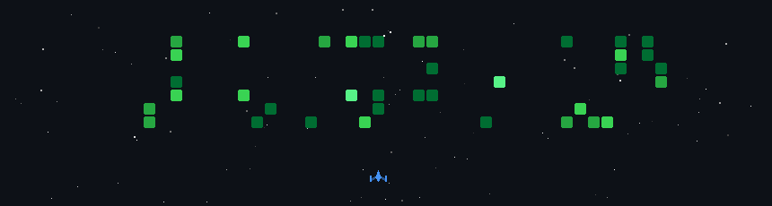

# Subhiksha

 

 

### About me

CS undergrad, building full-stack apps and exploring AI/ML on the side. Also co-author on a research paper (SemEval-2026, CodeBERT).

 

### This year, in commits

  
   
  my commit history, but it's a space shooter now

 

### Tech stack

**Languages**
 

**Frontend**
 

**Backend**
 

**Databases**
 

**Tools**
 

 

### Research

- **[Team Duo at SemEval-2026 Task 13: Fine-tuning CodeBERT for Out-of-Distribution AI-Generated Code Detection](https://aclanthology.org/2026.semeval-1.265/)** *(published, ACL Anthology)* — co-author, fine-tuning CodeBERT to detect AI-generated code across domains (F1 0.99 in-domain, 0.35 OOD)

 

thanks for stopping by

